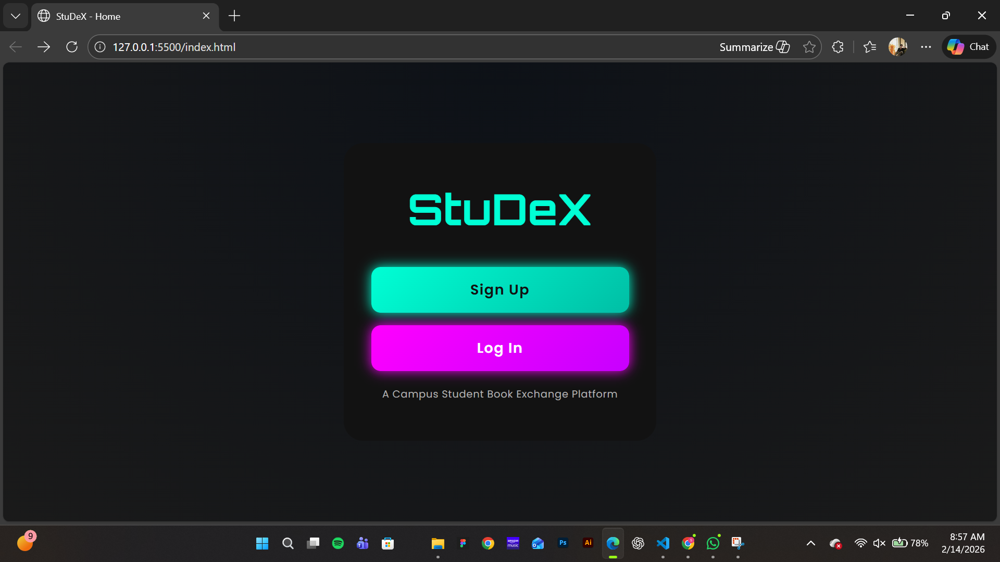

  

# [StuDeX] 🎯

## Basic Details

### Team Name: [scoobedey]

### Team Members
- Member 1: [shamna ck] - [Emea arts and science college]
- Member 2: [sarafulaya pk] - [Emea arts and science college]

### Hosted Project Link
[https://zoro-120.github.io/Studex/]

### Project Description
[a website for secondhand book exchange, between students in the college]

### The Problem statement
[buying new book for all sem might be too expensive and asking seniors who has book is also tiresome  . ]

### The Solution
[created a website where the the person who has book can upload the book pic and details and the person who is looking for it can  buy for half the price or maybe less . so the person who bought it also get half money]

---

## Technical Details

### html,css,java script

**For Software:**
- Languages used: [ JavaScript, css,html]
-
- Tools used: [ VS Code, Git, chat gpt]

---

## Features

List the key features of your project:
- Feature 1: [trustworthy since it is student initiative]
- Feature 2: [the payment for the book is done through offline]
- Feature 3: [easy to use ]
- Feature 4: [solves a big issue]

---

#### Screenshots (Add at least 3)

*the website*

